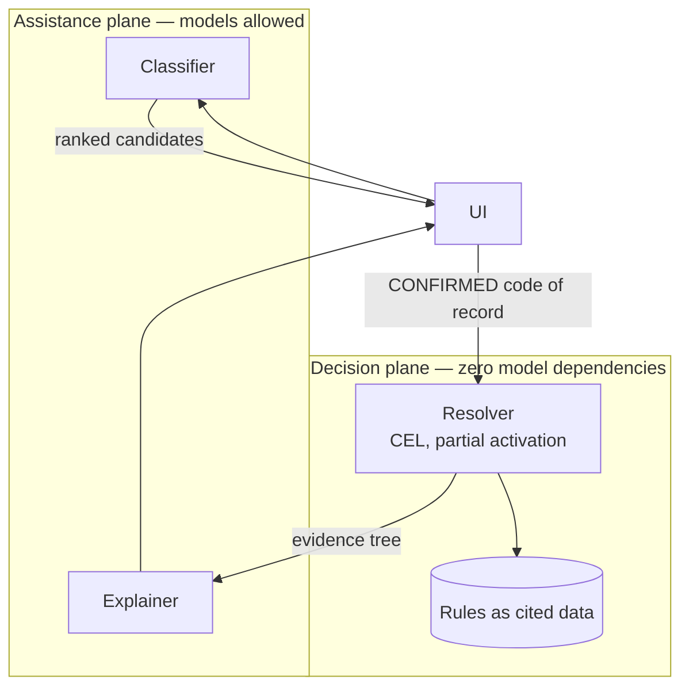

# PermitGraph

**Deterministic obligation resolution for state business one-stop portals.**

> Built clean-room from public sources. It reproduces no client system, contains no
> client data, and names no client. Every substantive claim traces to a public citation.

A ten-minute read. If you have three, open these instead:

- [Architecture (C4)](https://github.com/wildgen3/permitgraph/blob/main/docs/09-architecture-c4.md)
- [19 architecture decision records](https://github.com/wildgen3/permitgraph/blob/main/docs/adr/README.md)
- [The rules DSL and its linter](https://github.com/wildgen3/permitgraph/blob/main/docs/06-rules-dsl.md)

---

## 1. The problem class

Somewhere around twenty US states run a partial "business one-stop" portal. Roughly
thirty run none — a Secretary of State registration page, and after that you are on your
own.

Even the good ones share a failure mode. **Each agency owns its own form. Nobody owns the
order.**

Someone opening a shop can find the state business licence, the trade licence, the local
tax certificate, and the health permit — each on its own site, with its own account and
its own identifier — and still not know that three of them require a fourth to exist
first, or that one is issued only after an inspection that takes six weeks to schedule.

The information is public. The *sequence* is not written down anywhere.

This project is my answer to that problem, designed from first principles and built
entirely from public sources. Every substantive claim in the repository carries a citation
you can check.

## 2. What "unsiloed" actually means

Not single sign-on, though that helps. Not a shared database, which no state is going to
build and any design requiring it is a design that never ships.

What is missing is a **model**: one representation of a business against which every
agency's rules can be evaluated, producing an ordered graph of what that specific
business must obtain. The agencies stay where they are. What gets unified is the
reasoning.

## 3. Constraints

Constraints are where this kind of system is actually decided. The architecture is
downstream of every line here, and each one is checkable against the public record.

**No shared business identifier.** Agencies do not share a key. Identity resolution is a
first-class problem, not a join.

**Authority boundaries are legal, not organisational.** One agency cannot make a
determination on another's behalf. The system can *tell* you what is required; it cannot
decide on the regulator's behalf, and some determinations are assignable only by the
issuing authority. That is a distinct outcome in the type system, not an error state.

**Rules change by legislative session.** Not on a deploy cadence. Rules are versioned,
effective-dated data, and every read is an as-of query — otherwise you retroactively
rewrite what a business was told.

**Determinations get appealed.** "Why did it say that in March" must have an answer. That
single requirement forbids any sampled model output in the decision path, and it is why
the architecture has a hard seam through the middle of it.

**Being wrong is expensive and asymmetric.** A missed obligation becomes a fine. A
spurious question is an inconvenience. False negatives are the gated metric; accuracy is
secondary.

**Users cannot classify their own businesses.** The government's own tool for this task
reports 90.1% code accuracy but **75.5% end-to-end success**. The gap is not retrieval —
it is that people cannot recognise their own business in a list of official category
titles. Any design that assumes the applicant knows their code is already broken.

**Procurement and accreditation timelines outlast the design.** A system that requires
replacing an agency's system of record will not be procured. Modernisation happens
alongside, through adapters, or not at all.

**Accessibility is a legal requirement.** WCAG 2.2 AA and Section 508, plus a
plain-language reading level. Not polish.

## 4. Architecture

Two planes, and the split is the whole design.

Note the arrow directions. The classifier hands candidates to the **UI**, never to the
resolver. The resolver accepts only a code a human has confirmed. The explainer receives
an already-computed evidence tree and may only render nodes present in it.

There is no path by which a model output reaches a determination — and that is enforced
by a build gate on the import graph plus a database `CHECK` constraint, not by a code
review convention.

## 5. Decisions

| Decision | Rejected alternative | Why |
| --- | --- | --- |
| [The rules engine is the system of record; models never decide](https://github.com/wildgen3/permitgraph/blob/main/docs/adr/0001-rules-engine-is-the-system-of-record.md) | Model decides, human reviews | A sampled decision is not reproducible, and an unreproducible determination cannot be appealed |
| [A code hit proves inclusion; a code miss proves nothing](https://github.com/wildgen3/permitgraph/blob/main/docs/adr/0008-list-polarity-is-typed.md) | Treat every code list as exhaustive | Only 5 of 11 categories in one federal rule cite a code at all, and those are examples. Wrong exclusions are invisible to the person they harm |
| [Missing input is UNKNOWN, never false](https://github.com/wildgen3/permitgraph/blob/main/docs/adr/0006-kleene-three-valued-logic.md) | Two-valued logic | Absence-as-false silently returns "does not apply" to every business nobody has asked yet |
| [Codes are `(scheme, vintage, code)` triples](https://github.com/wildgen3/permitgraph/blob/main/docs/adr/0002-scheme-vintage-code-triple.md) | Bare code strings | At least seven codes were reused for *different concepts* across revisions. Cheap on day one, a rewrite later |
| [Author in YAML, compile to CEL](https://github.com/wildgen3/permitgraph/blob/main/docs/adr/0007-author-yaml-compile-to-cel.md) | OPA/Rego | Rego's negation-as-failure — `not p` succeeding on absent data — is the exact bug being engineered against |

## 6. What I built versus what I specified

Stated plainly, because the alternative is letting a reader assume.

| | State |
| --- | --- |
| Canonical domain model | **Built.** LinkML, generating JSON Schema, SHACL, Postgres DDL, Pydantic, TypeScript, JSON-LD — committed and diff-gated |
| Rules DSL | **Specified and validated.** Two regimes authored as cited data; the linter runs |
| Rules engine | **Interface only.** The evaluator lands with the vertical slice |
| Credential model | **Built as data.** A five-node chain including a real AND-of-ORs; the graph is cycle-checked in CI |
| Classifier, resolver, UI | **Not written.** Contracts defined, directories carry an honest `status` |
| Infrastructure | **Bootstrap written.** Workload Identity, no service account keys, budget before first resource |
| Eval harness | **Specified.** Baselines are explicit placeholders — a baseline file with invented numbers is worse than an empty one |

The repository cannot overstate itself: every directory declares `specified`,
`scaffolded`, or `implemented`, and a build gate fails if any of them disagrees with the
table on the front page.

## 7. Evidence the gates are real

Five gates run today and fail the build. Each was verified by **planting the defect it
exists to catch**:

| Planted defect | Caught by |
| --- | --- |
| Size predicate moved from company scope to establishment scope — the real-world recordkeeping bug | `L-04`, naming the attribute and both scopes |
| Negation over an illustrative code list | `L-01` |
| A cycle in the credential dependency graph | Graph integrity, printing the loop |
| A hand-edited ADR index | Index regeneration diff |
| A denylisted term in a document | Clean-room scanner |

A gate that has never failed is a gate nobody has tested.

## 8. How I worked with agents

The repository has an [`AGENTS.md`](https://github.com/wildgen3/permitgraph/blob/main/AGENTS.md)
where every rule traces to something that actually went wrong, and a **"What failed"**
log kept as a running record rather than pruned. Four entries from the build:

- **`make` was not installed and could not be installed.** A Makefile was written on the
  reasonable assumption that a Linux machine has `make`. Rule: verify a tool exists
  before building a workflow on it.
- **YAML silently coerced `TRUE:` and `FALSE:` to booleans**, renaming two enum values in
  *every* generated artifact. Nothing errored. Rule: assert on generated content, not on
  the generator's exit code.
- **The clean-room scanner's generic list flagged eleven lines of correct content**,
  because it carried bare words that collide with domain vocabulary — the exact failure
  the design document one directory away had already argued against. Rule: tune for zero
  false positives on a known-good tree before trusting a single finding.
- **The scanner then caught a denylisted term hard-coded in a shell script** on its first
  run with real terms. The leak was not in prose anyone would review carefully; it was in
  five lines of `rsync` nobody would think to check. That finding is what justifies the
  control.

The last two are the ones worth reading. A guardrail that has never produced a false
positive has probably never been exercised, and a guardrail that has never caught
anything is decoration.

## 9. What I would do differently

- **Choose the pilot jurisdiction against a live source-availability rubric before
  authoring any rules**, not after. Picking one on assumed data availability is how
  projects in this space die in month three. The rubric exists; it should have been run
  first.
- **Write the linter before the first rule.** The rules were authored, then the linter
  found real problems in them. In the other order the rules would have been right the
  first time.
- **Resist the second language longer.** The resolver is Go because cel-go has mature
  partial evaluation and Python's bindings do not. That is a defensible reason, but it is
  still two toolchains, and I would want to be certain no single-language path exists.

## 10. Thirty, sixty, ninety — a delivery plan for a system like this

How I would sequence the first quarter of a real deployment.

**Days 1–30. Find the actual constraint.** Not the stated one. Inventory the systems of
record and, more importantly, who is *allowed* to make which determination — the
authority boundaries are legal, and they will not appear on any architecture diagram.
Get read access to one agency's data and measure how bad the identity-resolution problem
really is. Ship one thing that works end to end for one business type, however narrow.

**Days 31–60. Make the invisible failure visible.** Instrument where applicants abandon,
and where staff override the system. Those two signals locate every wrong answer the
system is currently giving confidently. Establish the false-negative baseline: what is
being missed today, and by how much. Without that number every later improvement is an
assertion.

**Days 61–90. Prove the playbook, not the concept.** Onboard a second regime or a second
jurisdiction using only the written process. If it costs more than twice the first, the
playbook is wrong and scaling it will fail expensively — stop and fix it before the
third. That gate is worth more than any amount of additional architecture.

---

*Repository: [github.com/wildgen3/permitgraph](https://github.com/wildgen3/permitgraph)*
